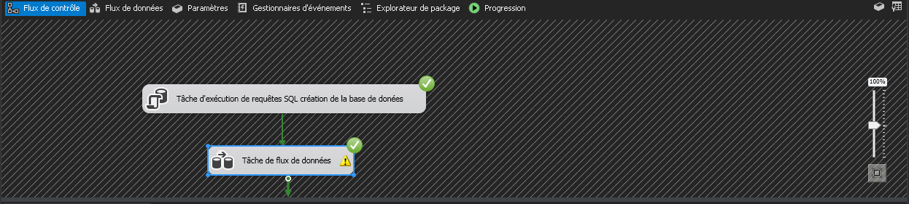

# Créer une connexion vers la base de données SQL Server

# Créer une connexion vers Excel

# Créer un Excel Source

# Changer le nom des Colonnes

# Mapping

# Conditionnel fractionnel

# Execution 

# Résulta dans SQLServer

